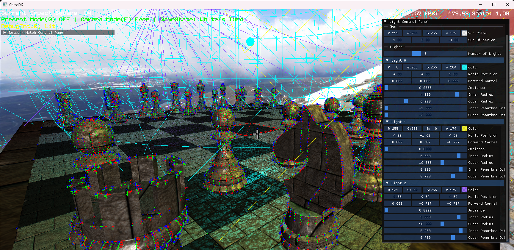
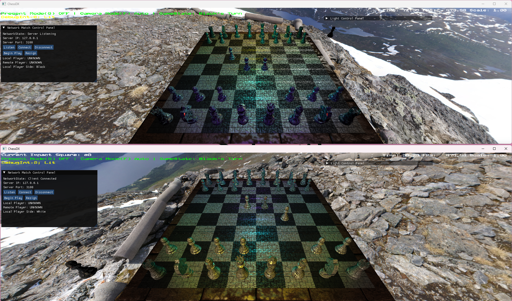

# ChessDX
Chess Game with DirectX 12 Rendering and Networked Multiplayer

## Features
- Basic Chess Rules
- Blinn-Phong Shading
- OBJ Model load and view
- TCP/IP + IPv4 multiplayer chess game

## Gallery
> Blinn Phong Shading (With Debug Keys)  
> 

> Light Control (ImGui)  
> 

> Network System  
> 


## How to run
Go to `PROJECT_NAME/Run/` and Run `PROJECT_NAME_Release_x64.exe`

## How to build
1. Clone Project
```bash
git clone --recurse-submodules https://github.com/cloud-sail/ChessDX.git
```
2. Open Solution `PROJECT_NAME.sln` file
- In Project Property Pages
  - Debugging->Command: `$(TargetFileName)`
  - Debugging->Working Directory: `$(SolutionDir)Run/`

## Controls
- `G` Toggle Present Mode
- `F` Toggle Auto Camera / Free-fly Camera
- Mouse Click to move chess pieces, hold ctrl to move pieces ignoring rules
- ` to open dev console. DevConsole commands are not listed.
